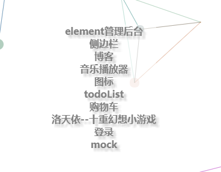
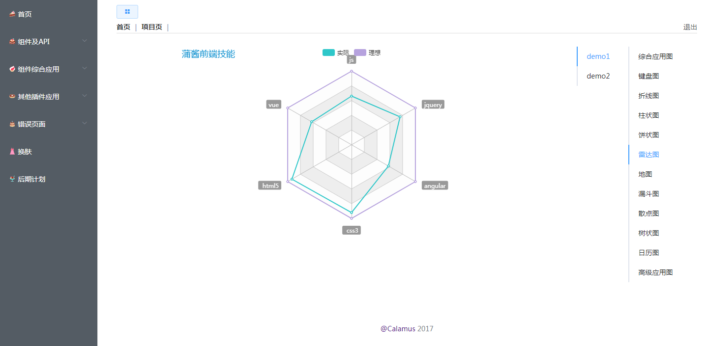

# Vue Element 管理后台
## 项目运行
### [在线预览](https://calamus0427.github.io/pages/myProject/vue-element-admin-cl/index.html)
 安装依赖：npm install

 运行：npm run dev

 编译：npm run build

## 技术栈
- vue
- element
- vue-markdown
- vue-router
- vue-markdown
- echarts
- vue-codemirror
- vue-editor2
- vue-bootstrap
- sass
- mavon editor
- mockjs
- webpack
- axios

## 基础功能
- 登录

- 首页
- 基础组件们

- echarts和vue的应用
- vue富文本编辑器
- vuemarkdown编辑器
- vue代码编辑器
- vue音乐播放器（未完成）
- vue视频播放器（未完成）
- vue和localstorage实现todolist
